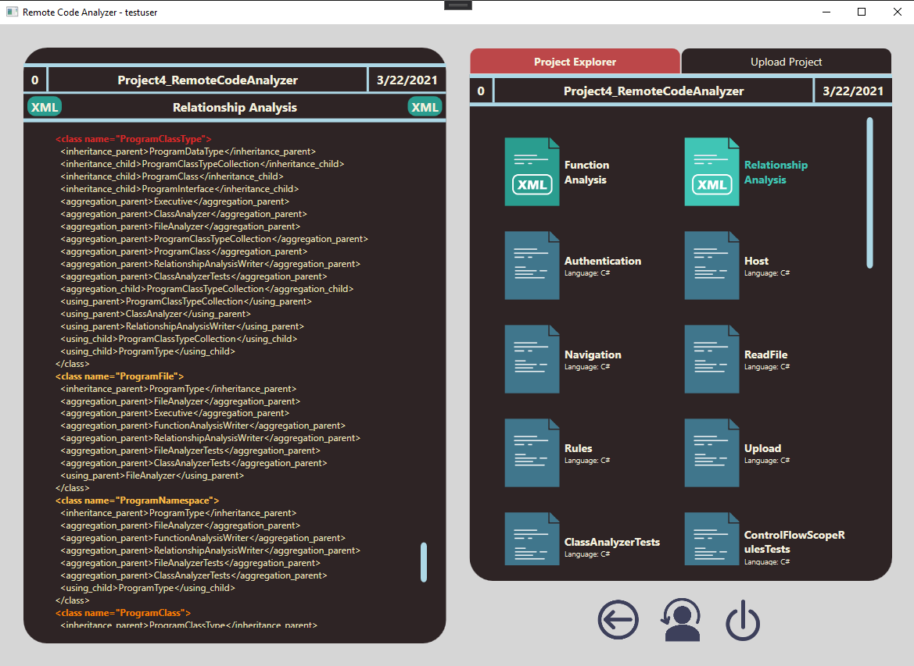

<div align="center" id="top"> 
  


</div>

<h1 align="center">Code Analyzer</h1>

<p align="center">
  

  


   


   
</p>

<!-- Status -->

<!-- <h4 align="center"> 
	🚧  Code Analyzer 🚀 Under construction...  🚧
</h4> 

<hr> -->

<p align="center">
  <a href="#dart-about">About</a> &#xa0; | &#xa0; 
  <a href="#sparkles-features">Features</a> &#xa0; | &#xa0;
  <a href="#rocket-technologies">Technologies</a> &#xa0; | &#xa0;
  <a href="#white_check_mark-requirements">Requirements</a> &#xa0; | &#xa0;
  <a href="#checkered_flag-starting">Starting</a> &#xa0; | &#xa0;
  <a href="https://github.com/silver-lotus" target="_blank">Author</a> &#xa0; | &#xa0;
  <a href="https://www.youtube.com/watch?v=qRalXBGUWpA&t=1s" target="_blank">Demo Video</a>
</p>


Uploading RCA_demo.mp4…


<br>

## :dart: About ##

This application provides remote version control and code analysis for C# and Java projects. It provides a valuable tool for developers working collaboratively to store individual projects in a central location with the ability to view each others' work. It additionally assists in code revision by analyzing uploaded files, quickly drawing the user's attention to potentially problematic classes and methods.

## :sparkles: Features ##

:heavy_check_mark: New user creation, login authentication\
:heavy_check_mark: Navigation throughout user, project, and version directories\
:heavy_check_mark: View project code files and analysis files\
:heavy_check_mark: New project creation within user's personal directory\
:heavy_check_mark: File upload supports multiple files of any supported type (.txt, .cs, .java)\
:heavy_check_mark: New project version automatically created when files are uploaded\
:heavy_check_mark: Function analysis and relationship analysis .xml files automatically created for each new version\
:heavy_check_mark: Potentially problematic classes and functions highlighted in analysis files according to severity

## :rocket: Technologies ##

The following tools were used in this project:

- [C#](https://docs.microsoft.com/en-us/dotnet/csharp/)
- [.Net Framework](https://docs.microsoft.com/en-us/dotnet/framework/)
- [Windows Presentation Foundation (WPF)](https://docs.microsoft.com/en-us/dotnet/desktop/wpf/?view=netdesktop-5.0)
- [Windows Communcation Foundation (WCF)](https://docs.microsoft.com/en-us/dotnet/framework/wcf/)
- [MSTest](https://docs.microsoft.com/en-us/visualstudio/test/using-microsoft-visualstudio-testtools-unittesting-members-in-unit-tests?view=vs-2019)


## :white_check_mark: Requirements ##

Before starting :checkered_flag:, you need to have [Git](https://git-scm.com) and [Visual Studio](https://visualstudio.microsoft.com/downloads/) installed to run in development.

## :checkered_flag: Starting ##

```bash
# Clone this project
$ git clone https://github.com/silver-lotus/CSE-681_RemoteCodeAnalyzer.git

# Access
$ cd CSE-681_RemoteCodeAnalyzer


# Install dependencies
$ nuget restore // this requires nuget.exe as an environment variable


# Run the project
Open the project solution (RemoteCodeAnalyzer.sln) in Visual Studio as Administrator. 
Right-click on the Solution at the top of the SolutionExplorer tab. 
Select "Set Startup Projects..." from the dropdown menu. 
In the Property Pages window that opens, in Common Properties > Startup Project, select "Multiple startup projects:". 
Set the Actions for Server and Client to "Start", and all others to "None". 
Arrange the projects so that the Server is above the Client. 
The Server and Client can now be run using the "Start" button. 
If the Client does not open shortly after the Server, try building clean or rebuilding

# The server will initialize in the <http://localhost:8000>
```


Created by <a href="https://github.com/silver-lotus" target="_blank">Alifa Stith</a>

&#xa0;

<a href="#top">Back to top</a>
